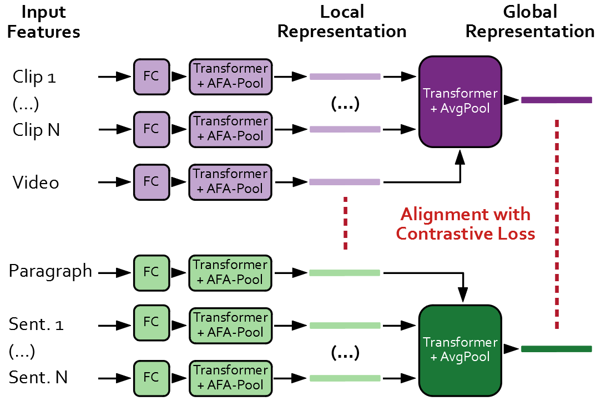

# COOT: Cooperative Hierarchical Transformer for Video-Text Representation Learning

Code for the above paper released at the 34th Conference on Neural Information Processing Systems (NeurIPS 2020), Vancouver, Canada.

## Roadmap

### Current Version

- Reproduce the evaluation results on Video-Text Retrieval either with the provided models or by training them from scratch. Configurations and weights for the COOT models described in tables 2 and 3 of the paper are provided.

### Planned

- Reproduce the results on Video Captioning described in tables 4 and 5.
- Improve code to make it easier to input a custom dataset.

## Prerequisites

Requires `Python>=3.6`, `PyTorch>=1.4`. Tested on Ubuntu. At least 8GB of free RAM are needed to load the text features into memory. GPU training is recommended for speed (requires 2x11GB GPU memory).

## Installation

1. Install Python and PyTorch
1. Clone repository: `git clone https://github.com/gingsi/coot-videotext`
1. Set working directory to be inside the repository: `cd coot-videotext`
1. Install other requirements `pip install -r requirements.txt`
1. All future commands in this Readme assume that the current working directory is the root of this repository

## Prepare datasets

### ActivityNet Captions

~~~bash
# 1) download / extract features (55GB zipped)
bash dl_gdrive.sh 13ZnIfBRShld8KOKJV3kpOLJPFkl12V9J data/activitynet/ICEP_V3_global_pool_skip_8_direct_resize.tar.gz
tar -C data/activitynet/features -xvzf data/activitynet/ICEP_V3_global_pool_skip_8_direct_resize.tar.gz
# 2) preprocess dataset and compute bert features
python prepare_activitynet.py
python run_bert.py activitynet --cuda
~~~

**Alternative manual download:** [Download Link](https://drive.google.com/file/d/13ZnIfBRShld8KOKJV3kpOLJPFkl12V9J/view?usp=sharing) or [Mirror Link](https://drive.google.com/file/d/1Gir-cRLhVpqjyADq55r5VF9Cs9YdOOz9/view?usp=sharing) and extract such that the folder structure is `data/activitynet/features/ICEP_V3_global_pool_skip_8_direct_resize/v_XXXXXXXXXXX.npz`

### Youcook2 with ImageNet/Kinetics Features

~~~bash
# 1) download / extract 13GB features
bash dl_gdrive.sh 1q7QocJq3mDJU0VxqJRZhSbqdtPerC4PS data/youcook2/video_feat_2d3d.tar.gz
tar -C data/youcook2 -xzvf data/youcook2/video_feat_2d3d.tar.gz
# 2) preprocess dataset and compute bert features
python prepare_youcook2.py
python run_bert.py youcook2 --cuda --metadata_name 2d3d
~~~

**Alternative manual download:** [Download](https://drive.google.com/file/d/1q7QocJq3mDJU0VxqJRZhSbqdtPerC4PS/view?usp=sharing)  and extract to `data/youcook2/video_feat_2d3d.h5`

### Youcook2 with Howto100m features

~~~bash
# 1) download / extract features (700MB)
bash dl_gdrive.sh 1oWSg7mvZE2kP_Ig4-OdNjRPAMqDghwag data/youcook2/video_feat_100m.tar.gz
tar -C data/youcook2 -xzvf data/youcook2/video_feat_100m.tar.gz
# 2) preprocess dataset and compute bert features
python prepare_youcook2.py --howto100m
python run_bert.py youcook2 --cuda --metadata_name 100m
~~~

**Alternative manual download:** [Download](https://drive.google.com/file/d/1oWSg7mvZE2kP_Ig4-OdNjRPAMqDghwag/view?usp=sharing)  and extract to `data/youcook2/video_feat_100m.h5` 

## Download provided models for evaluation

~~~bash
# 1) download / extract models (100MB)
bash dl_gdrive.sh 1JPN8v3sz4rRvqo5CB76lrOdCh6kSDkg4 provided_models.tar.gz
tar -xzvf provided_models.tar.gz
~~~

**Alternative manual download:** [Download](https://drive.google.com/file/d/1JPN8v3sz4rRvqo5CB76lrOdCh6kSDkg4/view?usp=sharing) and extract to `provided_models/MODEL_NAME.pth`

## Run

###  Script flags

~~~
--preload_vid  # preload video features to RAM (~110GB RAM needed for activitynet, 60GB for youcook2 resnet/resnext, 20GB for youcook2 howto100m)
--workers N    # change number of parallel dataloader workers, default: min(10, N_CPU - 1)
--cuda         # run on GPU
--single_gpu   # run on only one GPU
~~~

### Notes for training

- We use early stopping. Models are evaluated automatically and results are output during training. To evaluate a model again after training it, check the end of the script output or the logfile in path `runs/MODEL_NAME/log_DATE_TIME.log` to find the best epoch. Then run `python eval.py config/MODEL_NAME.yaml runs/MODEL_NAME/ckpt_ep##.pth`
- When training from scratch, actual results may vary due to randomness (no fixed seeds).
- Described train time assumes data preloading with `--preload_vid` and varies due to early stopping.

### Table 2: Video-paragraph retrieval results on AcitvityNet-captions dataset (val1).

| Model | Paragraph->Video R@1 | R@5  | R@50 | Video->Paragraph R@1 | R@5  | R@50 | Command to train from scratch                                | Command to evaluate provided model                           | Train time |
| ----- | -------------------- | ---- | ---- | -------------------- | ---- | ---- | ------------------------------------------------------------ | ------------------------------------------------------------ | ---------- |
| COOT  | 61.3                 | 86.7 | 98.7 | 60.6                 | 87.9 | 98.7 | `python train.py config/anet_coot.yaml --cuda --log_dir runs/anet_coot` | `python eval.py config/anet_coot.yaml provided_models/anet_coot.pth --cuda --workers 10` | ~70min     |

### Table 3: Retrieval Results on Youcook2 dataset

| Model                             | Paragraph->Video R@1 | R@5  | R@10  | MR   | Sentence->Clip R@1 | R@5  | R@50 | MR   | Command to train from scratch                                | Command to evaluate provided model                           | Train time |
| --------------------------------- | -------------------- | ---- | ----- | ---- | ------------------ | ---- | ---- | ---- | ------------------------------------------------------------ | ------------------------------------------------------------ | ---------- |
| COOT with Resnet/Resnext features | 51.2                 | 79.9 | 88.20 | 1    | 6.6                | 17.3 | 25.1 | 48   | `python train.py config/yc2_2d3d_coot.yaml --cuda --log_dir runs/yc2_2d3d_coot` | `python eval.py config/yc2_2d3d_coot.yaml provided_models/yc2_2d3d_coot.pth --cuda` | ~180min    |
| COOT with Howto100m features      | 78.3                 | 96.2 | 97.8  | 1    | 16.9               | 40.5 | 52.5 | 9    | `python train.py config/yc2_100m_coot.yaml --cuda --log_dir runs/yc2_100m_coot` | `python eval.py config/yc2_100m_coot.yaml provided_models/yc2_100m_coot.pth --cuda` | ~16 min    |

## Additional information

The default datasets folder is `data/`. To use a different folder, copy the data folder, supply all python scripts with flag `--dataroot new_path` and change the commands for dataset preprocessing accordingly.

### Preprocessing steps, done automatically

- Activitynet
    - Switch start and stop timestamps when stop > start. Affects 2 videos.
    - Convert start/stop timestamps to start/stop frames by multiplying with FPS in the features and using floor/ceil operation respectively.
    - Captions: Replace all newlines/tabs/multiple spaces with a single space.
    - Cut too long captions (>512 bert tokens in the paragraph) by retaining at least 4 tokens and the [SEP] token for each sentence. Affects 1 video.
    - Expand clips to be at least 10 frames long
        - train/val_1:  2823 changed / 54926 total
        - train/val_2: 2750 changed / 54452 total
- Activitynet and Youcook2
    - Add [CLS] at the start of each paragraph and [SEP] at the end of each sentence before encoding with Bert model.

## Citation

Publication pending.

## License

This code is licensed under Apache2, see LICENSE file.

Copyright 2020 S. Ging
